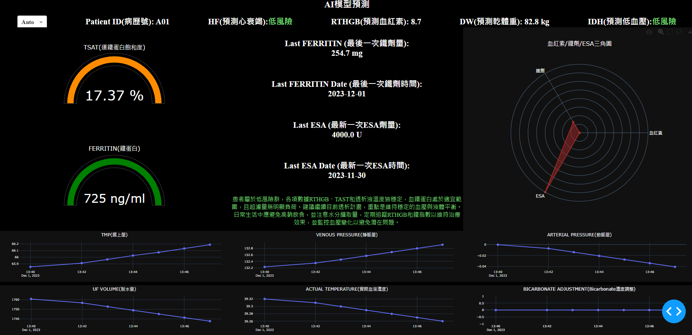
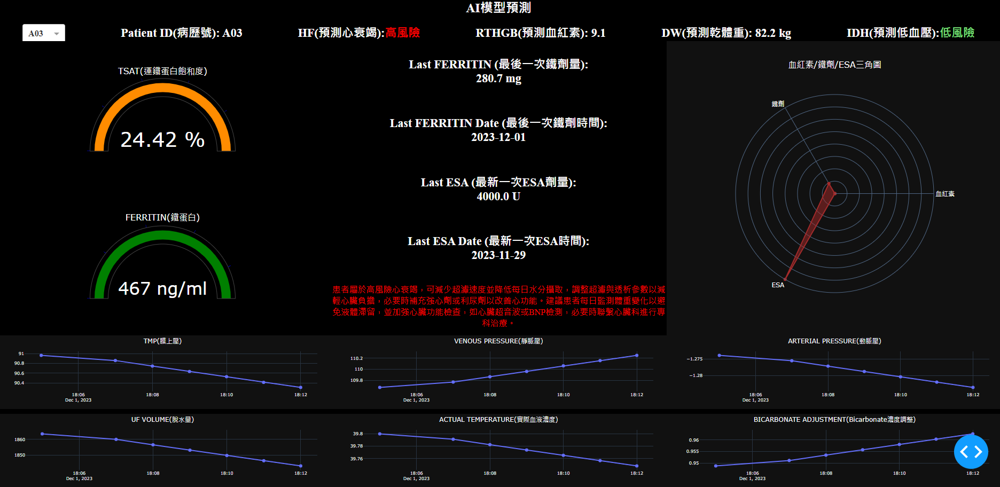
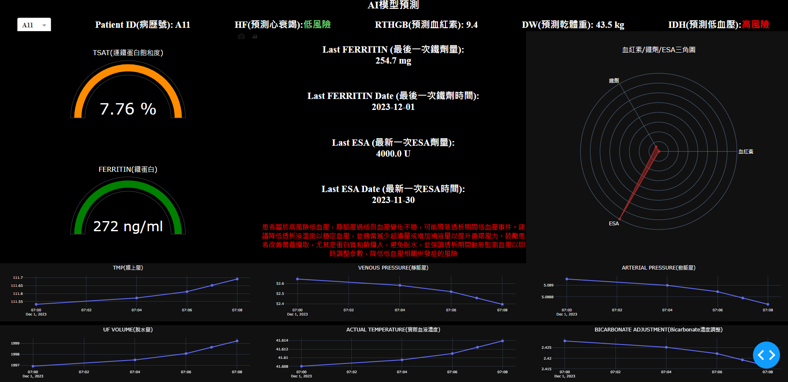

# MedEdge-Predictor
## Disease risk prediction model, deployed on NVIDIA Jetson Orin for real-time inference

[](https://www.python.org/downloads/)
[](https://github.com/microsoft/LightGBM)
[](https://dash.plotly.com/)
[](https://www.nvidia.com/en-us/autonomous-machines/embedded-systems/jetson-orin/)
[](https://www.docker.com/)

## Overview

A comprehensive machine learning system designed for **real-time health prediction** in hemodialysis patients. This system integrates three predictive models to assist healthcare professionals in monitoring and managing dialysis patients, deployed on NVIDIA Jetson Orin edge devices for real-time inference.

### Key Features

- **Heart Failure Risk Prediction** - Binary classification model to identify patients at high risk of heart failure
- **Hemoglobin Level Prediction** - Regression model to predict real-time hemoglobin (RTHGB) values for anemia management
- **Dry Weight Prediction** - Regression model to estimate optimal dry weight for fluid management
- **Real-time Dashboard** - Interactive visualization deployed on edge devices for clinical decision support
- **Edge AI Deployment** - Optimized for NVIDIA Jetson Orin with Docker containerization

---

## Table of Contents

- [System Architecture](#system-architecture)
- [Models](#models)
  - [Heart Failure Model](#1-heart-failure-prediction-model)
  - [Hemoglobin Model](#2-hemoglobin-rthgb-prediction-model)
  - [Dry Weight Model](#3-dry-weight-prediction-model)
- [Dashboard](#dashboard)
- [Installation](#installation)
- [Usage](#usage)
- [Deployment](#deployment)
- [Project Structure](#project-structure)
- [Technical Details](#technical-details)
- [Results](#results)
- [License](#license)

---

## System Architecture

```
┌─────────────────────────────────────────────────────────────────────────────┐
│                        Medical Prediction System                            │
│                        Medical Prediction System                            │
├─────────────────────────────────────────────────────────────────────────────┤
│                                                                             │
│                                                                             │
│  ┌──────────────┐    ┌──────────────┐    ┌──────────────┐                   │
│  │   Hospital   │    │    Data      │    │   Feature    │                   │
│  │   Database   │───▶│ Preprocessing│───▶│ Engineering  │                   │
│  │  (Private)   │    │              │    │              │                   │
│  └──────────────┘    └──────────────┘    └──────────────┘                   │
│                                                 │                           │
│                    ┌────────────────────────────┼────────────────────────┐  │
│                    │                            ▼                        │  │
│                    │  ┌──────────────────────────────────────────────┐   │  │
│                    │  │              ML Models (LightGBM)            │   │  │
│                    │  ├──────────────┬──────────────┬────────────────┤   │  │
│                    │  │ Heart Failure│  Hemoglobin  │   Dry Weight   │   │  │
│                    │  │(Classification│ (Regression)│  (Regression)  │   │  │
│                    │  │   Binary)    │    RMSE      │     RMSE       │   │  │
│                    │  └──────────────┴──────────────┴────────────────┘   │  │
│                    │                            │                        │  │
│                    └────────────────────────────┼────────────────────────┘  │
│                                                 ▼                           │
│                    ┌─────────────────────────────────────────────────────┐  │
│                    │              Real-time Dashboard (Dash)             │  │
│                    │  • Patient monitoring    • Risk visualization       │  │
│                    │  • Clinical metrics      • Decision support         │  │
│                    └─────────────────────────────────────────────────────┘  │
│                                                 │                           │
│                                                 ▼                           │
│                    ┌─────────────────────────────────────────────────────┐  │
│                    │           NVIDIA Jetson Orin (Edge Device)          │  │
│                    │              Docker Containerized                   │  │
│                    └─────────────────────────────────────────────────────┘  │
│                                                                             │
│                                                 │                           │
│                    ┌────────────────────────────┼────────────────────────┐  │
│                    │                            ▼                        │  │
│                    │  ┌──────────────────────────────────────────────┐   │  │
│                    │  │              ML Models (LightGBM)            │   │  │
│                    │  ├──────────────┬──────────────┬────────────────┤   │  │
│                    │  │ Heart Failure│  Hemoglobin  │   Dry Weight   │   │  │
│                    │  │(Classification│ (Regression)│  (Regression)  │   │  │
│                    │  │   Binary)    │    RMSE      │     RMSE       │   │  │
│                    │  └──────────────┴──────────────┴────────────────┘   │  │
│                    │                            │                        │  │
│                    └────────────────────────────┼────────────────────────┘  │
│                                                 ▼                           │
│                    ┌─────────────────────────────────────────────────────┐  │
│                    │              Real-time Dashboard (Dash)             │  │
│                    │  • Patient monitoring    • Risk visualization       │  │
│                    │  • Clinical metrics      • Decision support         │  │
│                    └─────────────────────────────────────────────────────┘  │
│                                                 │                           │
│                                                 ▼                           │
│                    ┌─────────────────────────────────────────────────────┐  │
│                    │           NVIDIA Jetson Orin (Edge Device)          │  │
│                    │              Docker Containerized                   │  │
│                    └─────────────────────────────────────────────────────┘  │
│                                                                             │
└─────────────────────────────────────────────────────────────────────────────┘
```

---

## Models

### 1. Heart Failure Prediction Model

**Type:** Binary Classification
**Algorithm:** LightGBM (Gradient Boosted Decision Trees)
**Target Variable:** `HF_1` (1 = High Risk, 0 = Low Risk)

#### Purpose
Identifies hemodialysis patients at elevated risk of heart failure based on clinical and dialysis session features. Early detection enables proactive intervention and improved patient outcomes.

#### Key Features
- SMOTE (Synthetic Minority Over-sampling Technique) for handling class imbalance
- Yeo-Johnson power transformation for skewed features
- StandardScaler normalization
- One-hot encoding for categorical variables

#### Evaluation Metrics
| Metric | Description |
|--------|-------------|
| Accuracy | Overall prediction correctness |
| Precision | True positives / Predicted positives |
| Recall | True positives / Actual positives |
| F1-Score | Harmonic mean of precision and recall |
| AUC-ROC | Area under the ROC curve |

#### Model Interpretability
- Feature importance analysis (split and gain)
- SHAP (SHapley Additive exPlanations) values for explainability

---

### 2. Hemoglobin (RTHGB) Prediction Model

**Type:** Regression
**Algorithm:** LightGBM
**Target Variable:** `RTHGB_mapDate` (Real-Time Hemoglobin Value)

#### Purpose
Predicts real-time hemoglobin levels to support anemia management in dialysis patients. Anemia is a common complication requiring careful monitoring and treatment with ESA (Erythropoiesis-Stimulating Agents) and iron supplementation.

#### Clinical Significance
- Hemoglobin monitoring is critical for dialysis patient care
- Helps optimize ESA and iron therapy dosing
- Prevents complications from both low and high hemoglobin levels

#### Evaluation Metrics
| Metric | Description |
|--------|-------------|
| RMSE | Root Mean Squared Error |
| MSE | Mean Squared Error |
| MAPE | Mean Absolute Percentage Error |

---

### 3. Dry Weight Prediction Model

**Type:** Regression
**Algorithm:** LightGBM
**Target Variable:** `DryWeight_Y` (Target Dry Weight in kg)

#### Purpose
Estimates the optimal dry weight for hemodialysis patients. Dry weight is the target post-dialysis weight when excess fluid has been removed without causing symptoms.

#### Clinical Significance
- **Overhydration:** Can lead to hypertension, heart failure, pulmonary edema
- **Underhydration:** Can cause hypotension, cramps, dizziness
- Accurate dry weight estimation is crucial for fluid management

#### Target Label Generation
The dry weight target is calculated using a stability algorithm:
1. Track dry weight values across consecutive dialysis sessions
2. If dry weight remains stable for 9+ consecutive sessions, it's considered the true dry weight
3. This stable value becomes the prediction target

```python
# Stability determination logic
stable_count = 9  # Required consecutive stable sessions
is_stable = rolling_window(dry_weight, stable_count).apply(
    lambda x: len(set(x)) == 1  # All values identical
)
```

---

## Dashboard

### Real-time Visualization Dashboard

An interactive web-based dashboard built with **Plotly Dash** for real-time patient monitoring and clinical decision support.

### Dashboard Screenshots

#### Normal Patient - Low Risk Status
<p align="center">
  
</p>

*Dashboard display for a low-risk patient with stable vital signs and normal predictions.*

---

#### Heart Failure High Risk Alert
<p align="center">
  
</p>

*Dashboard highlighting a patient with elevated heart failure risk. The system displays clinical recommendations for intervention.*

---

#### Intradialytic Hypotension (IDH) Risk Alert
<p align="center">
  
</p>

*Dashboard showing a patient at risk of intradialytic hypotension. Real-time monitoring enables proactive management.*

---

#### Features

| Component | Description |
|-----------|-------------|
| **Patient Selector** | Dropdown to select specific patient or auto-carousel mode |
| **Risk Indicators** | Color-coded HF and IDH risk status (red/green) |
| **Prediction Display** | Real-time RTHGB and Dry Weight predictions |
| **Gauge Charts** | TSAT and FERRITIN level indicators |
| **Triangle Chart** | Hemoglobin/Iron/ESA balance visualization |
| **Time Series** | 6 charts tracking dialysis session parameters |
| **Clinical Recommendations** | AI-generated guidance based on risk levels |

#### Dashboard Parameters

| Parameter | Chart Title |
|-----------|-------------|
| A_TMP | Transmembrane Pressure (TMP) |
| A_VENOUSPRESSURE | Venous Pressure |
| A_ARTERIALPRESSURE | Arterial Pressure |
| A_TOTALUF | Ultrafiltration Volume |
| A_D_TEMPERATURE | Blood Temperature |
| A_BICARBONATEADJUSTMENT | Bicarbonate Adjustment |

---

## Installation

### Prerequisites

- Python 3.10 or higher
- Docker (for containerized deployment)
- NVIDIA Jetson Orin (for edge deployment)

### Local Installation

```bash
# Clone the repository
git clone https://github.com/huang422/MedEdge-Predictor.git
cd MedEdge-Predictor

# Create virtual environment
python -m venv venv
source venv/bin/activate  # On Windows: venv\Scripts\activate

# Install dependencies
pip install -r requirements.txt

# Or install as package
pip install -e .
```

### Docker Installation

```bash
# Build Docker image
./scripts/build_docker.sh

# Or manually
docker build -f docker/Dockerfile -t medical-prediction-dashboard .
```

---

## Usage

### Training Models

```python
from src.models import HeartFailureModel, HemoglobinModel, DryWeightModel
from src.data import DataPreprocessor, FeatureEngineer

# Initialize preprocessor
preprocessor = DataPreprocessor()

# Preprocess data
X, y = preprocessor.preprocess(df, target_column="HF_1")

# Train Heart Failure model
hf_model = HeartFailureModel(use_smote=True)
hf_model.train(X_train, y_train, X_val, y_val)

# Evaluate
metrics = hf_model.evaluate(X_test, y_test)
print(metrics)

# Save model
hf_model.save_model("weights/heart_failure_model.txt")
```

### Running Dashboard Locally

```python
from src.dashboard import create_app, run_server

# Create and run dashboard
app = create_app(data_path="./data/Pred_all.csv")
run_server(app)

# Access at http://localhost:8050
```

### Using Docker

```bash
# Run with Docker
docker run -p 8050:8050 medical-prediction-dashboard

# Or with docker-compose
docker-compose -f docker/docker-compose.yml up

# Access dashboard at http://localhost:8050
```

---

## Deployment

### NVIDIA Jetson Orin Deployment

The system is optimized for deployment on NVIDIA Jetson Orin edge devices.

#### Quick Deployment

```bash
# On development machine - build and export
./scripts/deploy_jetson.sh build
./scripts/deploy_jetson.sh export

# Transfer medical-prediction-dashboard.tar to Jetson device

# On Jetson Orin - load and run
./scripts/deploy_jetson.sh load
./scripts/deploy_jetson.sh start
```

#### Manual Deployment

```bash
# Build for ARM64
docker build --platform linux/arm64 \
    -f docker/Dockerfile.jetson \
    -t medical-prediction-dashboard .

# Export image
docker save -o medical-prediction-dashboard.tar medical-prediction-dashboard

# On Jetson device
sudo docker load -i medical-prediction-dashboard.tar
sudo docker run -d \
    --name medical-dashboard \
    --runtime nvidia \
    -p 8050:8050 \
    medical-prediction-dashboard
```

#### Deployment Commands Reference

| Command | Description |
|---------|-------------|
| `./scripts/deploy_jetson.sh build` | Build Docker image |
| `./scripts/deploy_jetson.sh export` | Export to tar file |
| `./scripts/deploy_jetson.sh load` | Load image on Jetson |
| `./scripts/deploy_jetson.sh start` | Start dashboard |
| `./scripts/deploy_jetson.sh stop` | Stop dashboard |
| `./scripts/deploy_jetson.sh status` | Check status |
| `./scripts/deploy_jetson.sh logs` | View logs |

---

## Project Structure

```
medical-prediction-system/
├── src/
│   ├── __init__.py
│   ├── config/
│   │   ├── __init__.py
│   │   └── settings.py          # Configuration parameters
│   ├── data/
│   │   ├── __init__.py
│   │   ├── preprocessor.py      # Data preprocessing
│   │   └── feature_engineering.py # Feature engineering
│   ├── models/
│   │   ├── __init__.py
│   │   ├── base.py              # Base model class
│   │   ├── heart_failure.py     # Heart failure model
│   │   ├── hemoglobin.py        # Hemoglobin model
│   │   └── dry_weight.py        # Dry weight model
│   ├── dashboard/
│   │   ├── __init__.py
│   │   ├── app.py               # Dashboard application
│   │   └── data_merger.py       # Prediction data merger
│   └── utils/
│       ├── __init__.py
│       ├── metrics.py           # Evaluation metrics
│       └── visualization.py     # Plotting utilities
├── docker/
│   ├── Dockerfile               # Standard Docker config
│   ├── Dockerfile.jetson        # Jetson-optimized config
│   ├── docker-compose.yml       # Standard compose
│   └── docker-compose.jetson.yml # Jetson compose
├── scripts/
│   ├── build_docker.sh          # Build script
│   └── deploy_jetson.sh         # Deployment script
├── docs/                        # Documentation
│   └── images/                  # Screenshots and diagrams
├── data/                        # Data directory (gitignored)
├── weights/                     # Model weights (gitignored)
├── requirements.txt             # Python dependencies
├── .gitignore
├── README.md                    # This file (English)
└── README_zh-TW.md             # Chinese documentation
```

---

## Technical Details

### Data Preprocessing Pipeline

1. **Missing Value Handling**
   - Drop columns with >50% missing values
   - KNN imputation for remaining missing values

2. **Feature Transformation**
   - Yeo-Johnson transformation for skewed features (skewness > 1)
   - StandardScaler normalization for numeric features

3. **Categorical Encoding**
   - One-hot encoding for alarm status flags
   - Special character cleaning in column names

4. **Time-based Splitting**
   - Training data: December
   - Test data: November
   - Validation: 20% of training data

### Model Configuration

```python
# LightGBM Classification Parameters
lgbm_classification_params = {
    "objective": "binary",
    "metric": ["binary_logloss", "auc"],
    "boosting_type": "gbdt",
    "num_leaves": 31,
    "learning_rate": 0.05,
    "feature_fraction": 0.9,
    "bagging_fraction": 0.8,
    "bagging_freq": 5,
    "num_boost_round": 2000
}

# LightGBM Regression Parameters
lgbm_regression_params = {
    "objective": "regression",
    "metric": "rmse",
    "boosting_type": "gbdt",
    "num_leaves": 31,
    "learning_rate": 0.05,
    "feature_fraction": 0.9,
    "bagging_fraction": 0.8,
    "bagging_freq": 5
}
```

### Dashboard Configuration

| Setting | Value |
|---------|-------|
| Refresh Interval | 3 seconds |
| Time Series Window | 10 data points |
| HF Risk Threshold | 0.5 |
| IDH Risk Threshold | 30% |
| Server Port | 8050 |

---

## Results

### Model Performance Summary

| Model | Task | Primary Metric | Algorithm |
|-------|------|----------------|-----------|
| Heart Failure | Classification | AUC-ROC | LightGBM |
| Hemoglobin | Regression | RMSE | LightGBM |
| Dry Weight | Regression | RMSE | LightGBM |

### Key Findings

- **Heart Failure Model:** Effective at identifying high-risk patients using SMOTE for class balancing
- **Hemoglobin Model:** Accurate prediction enables proactive anemia management
- **Dry Weight Model:** Stability-based labeling improves target quality

---

## Privacy & Refactoring Notice

**Important:** This project was developed using private hospital data during collaboration with a medical institution. Due to **privacy and data security considerations**, the code has been **refactored** for public portfolio display while preserving all core functionality and logic.

### Refactoring Approach

| Aspect | Original | Refactored |
|--------|----------|------------|
| **Code Structure** | Jupyter notebooks + scripts | Modular Python packages |
| **Database Connection** | Direct PostgreSQL queries | Configuration-based (credentials excluded) |
| **Patient Data** | Real medical records | Synthetic anonymized data |
| **Identifiers** | Actual MEDICALID | Anonymized IDs (A01, A02, ...) |

### What is Preserved

- **Core Machine Learning Logic:** All model training, preprocessing, and evaluation code maintains identical functionality to the production system
- **Algorithm Parameters:** LightGBM/XGBoost configurations match the deployed models
- **Feature Engineering:** SMOTE, Yeo-Johnson transformation, StandardScaler remain unchanged
- **Dashboard Functionality:** All visualization components, callbacks, and layouts are functionally equivalent
- **Clinical Logic:** Risk thresholds, recommendation logic, and medical parameters are authentic

### What is Modified for Security

- **Database Credentials:** Removed all connection strings and passwords
- **Patient Identifiers:** Replaced with synthetic anonymous IDs
- **Medical Data:** Sample data uses realistic but synthetic values
- **File Paths:** Generalized from institution-specific paths

### For Reviewers

This refactored version demonstrates:
1. **Technical Skills:** ML pipeline development, dashboard creation, Docker deployment
2. **Domain Knowledge:** Medical prediction systems, hemodialysis parameters
3. **Engineering Practices:** Modular design, configuration management, testing
4. **Security Awareness:** Proper handling of sensitive healthcare data

The original production code (not included) is deployed on NVIDIA Jetson Orin devices at the partner hospital.

---

## Technologies Used

| Category | Technologies |
|----------|-------------|
| **ML Framework** | LightGBM, XGBoost, scikit-learn |
| **Data Processing** | Pandas, NumPy, SciPy |
| **Visualization** | Plotly, Matplotlib, Seaborn |
| **Dashboard** | Plotly Dash |
| **Deployment** | Docker, NVIDIA Jetson |
| **Interpretability** | SHAP |

---

## License

This project is available for educational and portfolio demonstration purposes.

---

## Contact
For questions, issues, or collaboration inquiries:

- Developer: Tom Huang
- Email: huang1473690@gmail.com
For questions, issues, or collaboration inquiries:

- Developer: Tom Huang
- Email: huang1473690@gmail.com

---

## Acknowledgments

- Hospital partner for providing the clinical data and domain expertise
- NVIDIA for Jetson Orin edge computing platform
- Open source community for the excellent ML libraries
